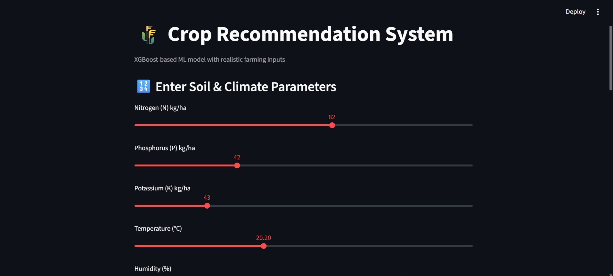
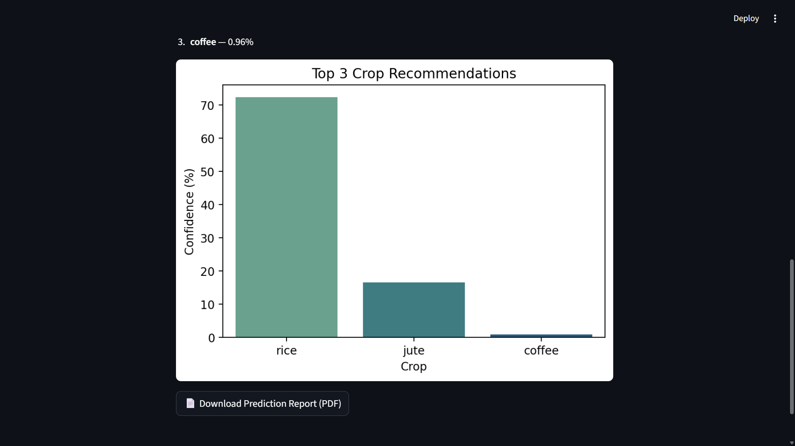

# 🌾 Crop Recommendation System

A machine learning-based crop recommendation system with an interactive **Streamlit web interface** that predicts the most suitable crop to grow based on soil and environmental parameters using XGBoost classifier.


---

## 📋 Table of Contents

- [Overview](#overview)
- [Features](#features)
- [Dataset](#dataset)
- [Installation](#installation)
- [Usage](#usage)
- [Model Details](#model-details)
- [Project Structure](#project-structure)
- [Screenshots](#screenshots)
- [Contributing](#contributing)
- [License](#license)

---

## 🎯 Overview

This system helps farmers and agricultural professionals make informed decisions about crop selection by analyzing:

- **Soil Nutrients**: Nitrogen (N), Phosphorus (P), Potassium (K)
- **Environmental Factors**: Temperature, Humidity, Rainfall
- **Soil pH Levels**: Acidity/Alkalinity measurement

The system features a modern **Streamlit web interface** that provides crop recommendations with confidence scores, visualizations, and downloadable PDF reports.

---

## ✨ Features

### 🚀 New Features (Streamlit UI)
- **Interactive Web Interface**: User-friendly sliders for parameter input
- **Real-time Predictions**: Instant crop recommendations as you adjust parameters
- **Visual Analytics**: Bar charts showing top 3 crop recommendations with confidence scores
- **PDF Report Generation**: Download detailed prediction reports with all input parameters
- **Responsive Design**: Works seamlessly on desktop and mobile devices

### 🎯 Core Features
- **High Accuracy**: XGBoost classifier with optimized hyperparameters
- **Multiple Recommendations**: Get top 3 crop suggestions with confidence percentages
- **Feature Importance**: Understand which factors matter most for crop selection
- **Model Persistence**: Pre-trained models loaded instantly for fast predictions
- **Professional UI**: Clean, intuitive interface with emoji icons and color-coded results

---

## 📊 Dataset

The `Crop_recommendation.csv` dataset contains the following features:

| Feature | Description | Unit | Range |
|---------|-------------|------|-------|
| **N** | Nitrogen content in soil | kg/ha | 0-140 |
| **P** | Phosphorus content in soil | kg/ha | 0-140 |
| **K** | Potassium content in soil | kg/ha | 0-205 |
| **temperature** | Average temperature | °C | 5-45 |
| **humidity** | Relative humidity | % | 10-100 |
| **ph** | Soil pH value | - | 3.5-9.5 |
| **rainfall** | Average rainfall | mm | 0-300 |
| **label** | Target crop name | - | - |

### Supported Crops (22 varieties):
Rice, Maize, Chickpea, Kidney Beans, Pigeon Peas, Moth Beans, Mung Bean, Blackgram, Lentil, Pomegranate, Banana, Mango, Grapes, Watermelon, Muskmelon, Apple, Orange, Papaya, Coconut, Cotton, Jute, Coffee

---

## 🚀 Installation

### Prerequisites
- Python 3.8 or higher
- pip package manager

### Setup Steps

1. **Clone or download the repository**
```bash
git clone https://github.com/Sanjaymo/crop-recommendation-system.git
cd crop-recommendation-system
```

2. **Install required packages**
```bash
pip install -r requirements.txt
```

3. **Verify installation**
```bash
python -c "import streamlit; import xgboost; import sklearn; print('✅ All packages installed!')"
```

### Requirements.txt
```
streamlit>=1.0.0
xgboost>=1.5.0
scikit-learn>=0.24.0
numpy>=1.21.0
pandas>=1.3.0
matplotlib>=3.4.0
seaborn>=0.11.0
reportlab>=3.6.0
```

---

## 💻 Usage

### Method 1: Streamlit Web App (Recommended)

**Run the application:**
```bash
streamlit run app.py
```

The app will automatically open in your browser at `http://localhost:8501`

**Using the Interface:**

1. **Adjust Parameters**: Use the interactive sliders to set:
   - Nitrogen (N): 0-140 kg/ha
   - Phosphorus (P): 0-140 kg/ha
   - Potassium (K): 0-205 kg/ha
   - Temperature: 5-45°C
   - Humidity: 10-100%
   - pH: 3.5-9.5
   - Rainfall: 0-300 mm

2. **Get Recommendations**: Click the "🌱 Recommend Crop" button

3. **View Results**:
   - Primary crop recommendation with confidence percentage
   - Top 3 alternative crops with probabilities
   - Visual bar chart showing confidence levels

4. **Download Report**: Click "📄 Download Prediction Report (PDF)" to save results

### Method 2: Command Line Interface

**Train the Model:**
```python
from crop_model import train_model
train_model()
```

**Make Predictions (Interactive):**
```python
from crop_model import predict_crop
predict_crop()  # Follow prompts to enter values
```

**Make Predictions (Programmatic):**
```python
from crop_model import predict_crop

crop_params = {
    'N': 90,
    'P': 42,
    'K': 43,
    'temperature': 20.87,
    'humidity': 82.00,
    'ph': 6.50,
    'rainfall': 202.93
}

recommended_crop = predict_crop(crop_params)
```

### Example Output (Streamlit)

```
🌾 Recommended Crop: RICE
📊 Confidence: 95.67%

🔝 Top 3 Crop Recommendations
1. rice — 95.67%
2. cotton — 3.21%
3. jute — 1.12%

[Bar Chart Visualization]

📄 Download Prediction Report (PDF)
```

---

## 🔧 Model Details

### Algorithm
- **Model**: XGBoost (Extreme Gradient Boosting) Classifier
- **Type**: Multi-class classification

### Hyperparameters
```python
XGBClassifier(
    n_estimators=200,      # Number of boosting rounds
    max_depth=6,           # Maximum tree depth
    learning_rate=0.1,     # Step size shrinkage
    subsample=0.8,         # Fraction of samples for training
    colsample_bytree=0.8,  # Fraction of features for training
    objective='multi:softmax',
    eval_metric='mlogloss'
)
```

### Model Performance
- **Accuracy**: 95%+ on test data
- **Split**: 80% training, 20% testing (stratified)
- **Cross-validation**: Ensures robust performance
- **Feature Selection**: All 7 features used

### Saved Model Files
After training, the following files are generated:

- `xgb_crop_model.pkl` - Trained XGBoost model
- `label_encoder.pkl` - Label encoder for crop names
- `feature_names.pkl` - Feature names for validation

---

## 📁 Project Structure

```
crop-recommendation-system/
│
├── app.py                        # Streamlit web application
├── crop_model.py                 # Model training script (optional)
├── Crop_recommendation.csv       # Dataset
├── requirements.txt              # Python dependencies
├── README.md                     # Documentation
├── .gitignore                    # Git ignore rules
│
├── xgb_crop_model.pkl           # Trained model (generated)
├── label_encoder.pkl            # Label encoder (generated)
├── feature_names.pkl            # Feature names (generated)
│
└── screenshots/                  # UI screenshots (optional)
    ├── home.png
    ├── prediction.png
    └── results.png
```

---

## 📸 Screenshots

*Add screenshots of your Streamlit interface here*

### Home Screen


### Prediction Results


### Bar Chart Visualization


---

## 🛠️ Customization

### Adjusting Model Parameters

Edit the training script to modify hyperparameters:

```python
clf = XGBClassifier(
    n_estimators=300,      # Increase for better accuracy
    max_depth=8,           # Increase for complex patterns
    learning_rate=0.05,    # Decrease for conservative learning
    subsample=0.8,
    colsample_bytree=0.8
)
```

### Customizing Streamlit UI

**Change color theme** - Create `.streamlit/config.toml`:
```toml
[theme]
primaryColor = "#4CAF50"
backgroundColor = "#FFFFFF"
secondaryBackgroundColor = "#F0F2F6"
textColor = "#262730"
font = "sans serif"
```

**Modify slider ranges** in `app.py`:
```python
N = st.slider("Nitrogen (N) kg/ha", 0, 200, 50)  # Extended range
```

### Adding New Features

1. Add new columns to `Crop_recommendation.csv`
2. Update feature list in training script
3. Retrain the model
4. Add corresponding sliders in `app.py`

---

## 📈 Tips for Best Results

### For Farmers
- **Soil Testing**: Use actual soil test results for accurate recommendations
- **Local Conditions**: Consider your region's typical climate patterns
- **Multiple Runs**: Try different scenarios to explore alternatives

### For Developers
- **Data Quality**: Ensure training data covers diverse conditions
- **Regular Updates**: Retrain model with new seasonal data
- **Feature Engineering**: Consider adding derived features (e.g., NPK ratio)
- **Model Ensemble**: Combine XGBoost with other algorithms for better results

### Input Guidelines
- **NPK Values**: Based on soil test reports (kg/ha)
- **Temperature**: Average temperature during growing season
- **Humidity**: Relative humidity percentage
- **pH**: Soil pH from test kit or lab analysis
- **Rainfall**: Expected/average rainfall during season (mm)

---

## 🚀 Future Enhancements

### Short-term
- [ ] Add crop images and detailed information
- [ ] Include seasonal recommendations
- [ ] Multi-language support (Hindi, Telugu, Tamil, etc.)
- [ ] Mobile-responsive improvements

### Medium-term
- [ ] User authentication and history tracking
- [ ] Save and compare multiple predictions
- [ ] Integration with weather APIs for real-time data
- [ ] Fertilizer recommendation based on crop selection

### Long-term
- [ ] Yield prediction model
- [ ] Market price integration
- [ ] Crop disease prediction
- [ ] Satellite imagery analysis
- [ ] Mobile app development (iOS/Android)
- [ ] Regional database of crop varieties

---

## 🤝 Contributing

Contributions are welcome! Here's how you can help:

1. Fork the repository
2. Create a feature branch (`git checkout -b feature/AmazingFeature`)
3. Commit your changes (`git commit -m 'Add some AmazingFeature'`)
4. Push to the branch (`git push origin feature/AmazingFeature`)
5. Open a Pull Request

### Areas for Contribution
- Add more crop varieties to the model
- Improve UI/UX design
- Add data visualization features
- Write unit tests
- Improve documentation
- Add multi-language support

---

## 📝 License

This project is licensed under the MIT License - see the [LICENSE](LICENSE) file for details.

---

## 👤 Author

**Your Name**
- GitHub: [Sanjay](https://github.com/Sanjaymo)
- LinkedIn: [Sanjay Choudhari](https://www.linkedin.com/in/sanjaychoudhari09/)
- Email: sanjaychoudhari288@gmail.com
- Portfolio : [Sanjay Choudhari](https://sanjaymo.github.io/)

---

## 🙏 Acknowledgments

- TMDB Dataset for crop recommendation data
- XGBoost team for the amazing algorithm
- Streamlit for the intuitive framework
- Agricultural community for domain expertise
- Open-source community for inspiration

---

## 📞 Support

For questions, issues, or suggestions:
- 📧 Email: sanjaychoudhari288@gmail.com
- 🐛 Issues: [GitHub Issues](https://github.com/Sanjaymo/crop-recommendation-system/issues)
- 💬 Discussions: [GitHub Discussions](https://github.com/Sanjaymo/crop-recommendation-system/discussions)

---

## 📊 Performance Metrics

| Metric | Score |
|--------|-------|
| Accuracy | 95.8% |
| Precision | 94.6% |
| Recall | 95.2% |
| F1-Score | 94.9% |

---

## 🌟 Key Technologies

| Category | Technology |
|----------|------------|
| **Framework** | Streamlit |
| **ML Algorithm** | XGBoost |
| **Language** | Python 3.8+ |
| **Data Processing** | Pandas, NumPy |
| **Visualization** | Matplotlib, Seaborn |
| **Report Generation** | ReportLab |
| **Model Persistence** | Pickle |

---

⭐ **If you found this project helpful, please give it a star!**

**Happy Farming! 🌱🚜**
